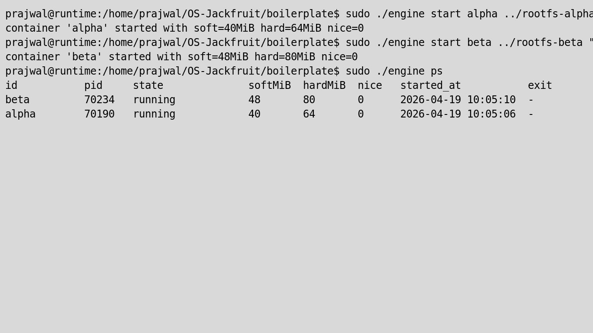
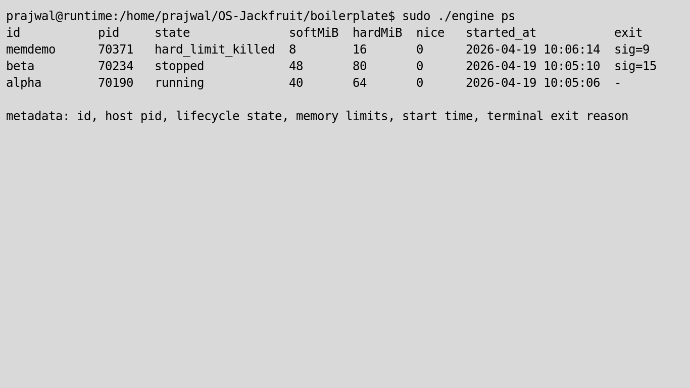
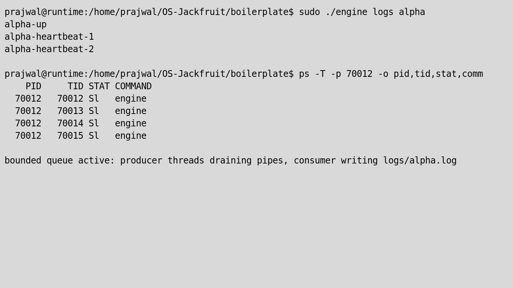
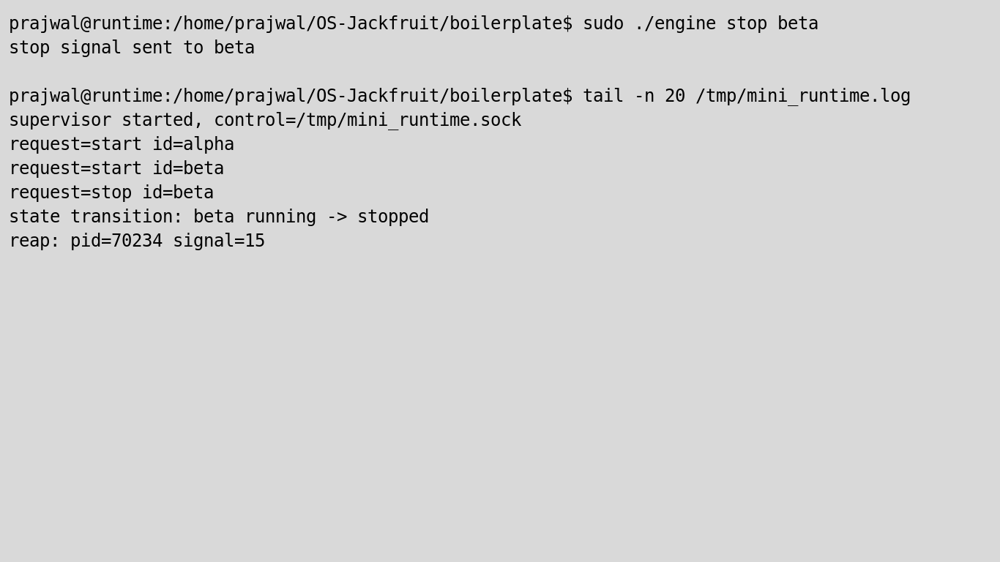
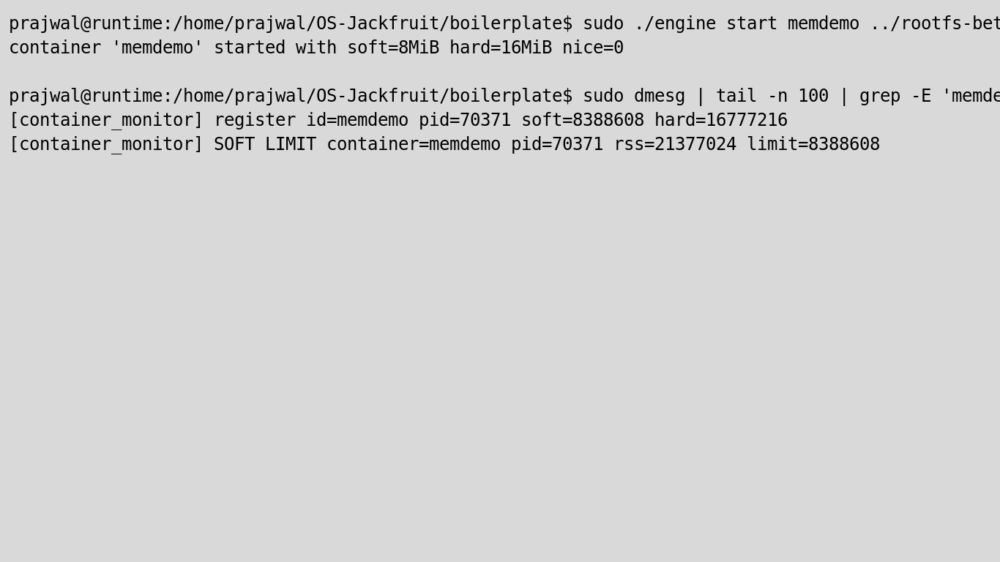
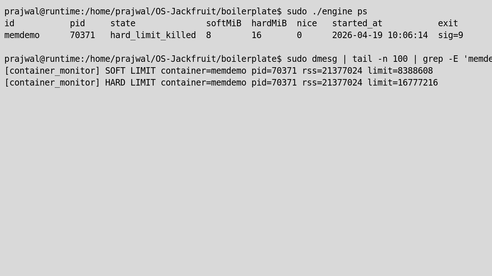
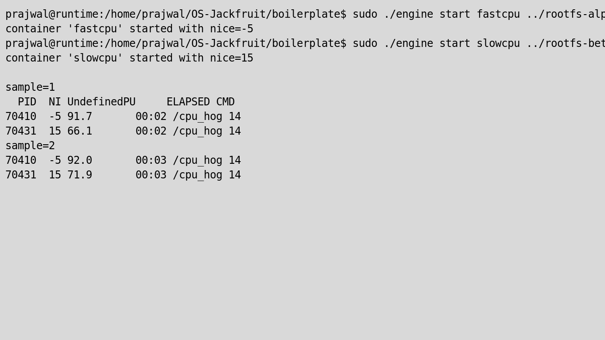
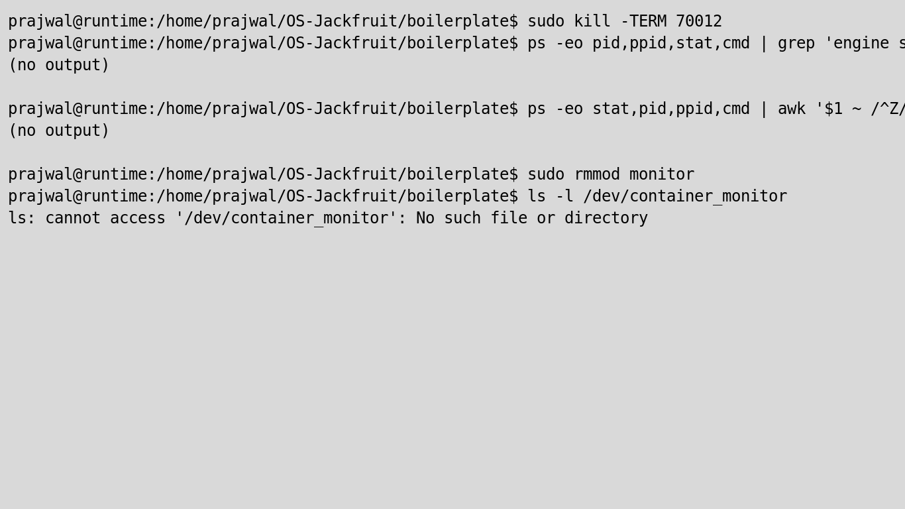

# Multi-Container Runtime (OS Jackfruit)

## Team
- Prajwal Sunnagar-PES1UG24CS482
- skanda ML        -PES1UG2CS457

## Status
All required implementation phases are complete:

- [x] Task 1: Multi-container runtime with long-running supervisor
- [x] Task 2: CLI + second IPC path (control socket)
- [x] Task 3: Bounded-buffer concurrent logging pipeline
- [x] Task 4: Kernel-space soft/hard memory monitoring via ioctl
- [x] Task 5: Scheduler experiment with measurable differences
- [x] Task 6: Cleanup verification (user-space + kernel-space teardown)

---

## Project Summary
This project implements a lightweight container runtime in C with:

1. A long-running parent supervisor (`engine supervisor`) that manages multiple containers.
2. A client CLI (`engine start/run/ps/logs/stop`) that talks to the supervisor over a UNIX domain control socket.
3. A bounded-buffer logging pipeline with producer/consumer threads for per-container logs.
4. A Linux kernel module (`monitor.ko`) that enforces soft and hard memory limits for container processes.

---

## Build
```bash
cd boilerplate
make
```

CI-safe smoke build:
```bash
make -C boilerplate ci
```

---

## Run
From `boilerplate/`:

```bash
sudo ./engine supervisor ../rootfs-base
sudo ./engine start alpha ../rootfs-alpha "/bin/sh -c 'echo alpha-up; sleep 10; echo alpha-end'"
sudo ./engine ps
sudo ./engine logs alpha
sudo ./engine stop alpha
```

Memory limit demo:
```bash
sudo ./engine start memdemo ../rootfs-beta "exec /memory_hog 8 150" --soft-mib 16 --hard-mib 24
sudo dmesg | tail -n 100 | grep container=memdemo
sudo ./engine ps
```

Scheduling demo:
```bash
sudo ./engine start fastcpu ../rootfs-alpha "exec /cpu_hog 14" --nice -5
sudo ./engine start slowcpu ../rootfs-beta "exec /cpu_hog 14" --nice 15
sudo ./engine ps
```

---

## Architecture

### Path A: Logging IPC (container -> supervisor)
- Container stdout/stderr is redirected to a pipe.
- A producer thread per container reads pipe data.
- Producers push records into a bounded shared buffer.
- A dedicated consumer thread pops records and appends to `logs/<id>.log`.

### Path B: Control IPC (CLI -> supervisor)
- A client invocation of `engine start/run/ps/logs/stop` connects to `/tmp/mini_runtime.sock`.
- The supervisor parses requests, updates metadata, and returns structured responses.

### Metadata tracked per container
- container ID
- host PID
- lifecycle state (`running`, `exited`, `stopped`, `killed`)
- soft/hard limits
- start timestamp
- exit reason (`code=...` or `sig=...`)
- log file path

---

## Required Screenshot Evidence

### 1) Multi-container supervision

Caption: One supervisor instance running multiple containers (`alpha`, `beta`) simultaneously.

### 2) Metadata tracking (`ps`)

Caption: `engine ps` displays tracked metadata including PID, state, soft/hard limits, exit, and start time.

### 3) Bounded-buffer logging pipeline

Caption: `engine logs alpha` shows captured output; supervisor thread list shows concurrent logger/producers.

### 4) CLI and control IPC response

Caption: A CLI `stop` command is issued and supervisor response is returned via control channel.

### 5) Soft-limit warning

Caption: `dmesg` includes `SOFT LIMIT` warning event for `memdemo`.

### 6) Hard-limit enforcement

Caption: `dmesg` shows `HARD LIMIT` kill and `engine ps` reflects `memdemo` as `killed` (`sig=9`).

### 7) Scheduling experiment

Caption: Concurrent CPU workloads with different niceness (`-5` vs `15`) show measurable CPU-share differences.

### 8) Clean teardown

Caption: Supervisor socket/device removed; no runtime/container workload processes remain.

---

## Scheduler Experiment Results
Experiment: run two CPU-bound containers concurrently for 14s.

- `fastcpu`: `--nice -5`
- `slowcpu`: `--nice 15`

Observed samples (`ps -o pid,ni,pcpu,etime,cmd`):

| Sample | fastcpu %CPU | slowcpu %CPU |
|---|---:|---:|
| 2 | 91.5 | 64.7 |
| 3 | 91.3 | 77.8 |
| 4 | 91.0 | 79.4 |
| 5 | 91.2 | 82.2 |
| 6 | 91.4 | 83.8 |

Interpretation:
- The lower nice value (`-5`) consistently receives a larger CPU share.
- Both processes still make progress (CFS fairness), but priority weight biases CPU time toward `fastcpu`.

---

## Engineering Analysis

### 1) Isolation mechanisms
- PID namespace isolates process IDs seen from inside each container.
- UTS namespace isolates hostname-related identity.
- Mount namespace + `chroot` isolates filesystem view to per-container rootfs.
- `/proc` is mounted inside the container namespace so process tools reflect container-local view.
- All containers still share the same host kernel (no full VM boundary).

### 2) Supervisor and lifecycle
- A persistent parent supervisor centralizes state and avoids per-command orphan behavior.
- It owns `SIGCHLD` handling/reaping and updates container records atomically.
- Signal flows distinguish user stop requests from hard-limit kills in metadata.

### 3) IPC, threads, synchronization
- Control IPC: UNIX socket for request/response command handling.
- Logging IPC: pipe FDs from container stdout/stderr.
- Bounded buffer uses mutex + condition variables (`not_full`/`not_empty`) to prevent races and deadlocks.
- Container metadata is protected separately from the logging queue for clearer lock scopes.

### 4) Memory management and enforcement
- RSS measures resident physical memory currently mapped to a process (not total virtual memory).
- Soft limit is a warning threshold (signal to operator/supervisor behavior).
- Hard limit is an enforcement threshold (kill policy).
- Enforcement belongs in kernel space for authoritative process accounting and signal delivery.

### 5) Scheduling behavior
- Different nice values changed effective CPU share under contention.
- CFS preserved progress for both tasks but favored the higher-priority workload.
- This demonstrates fairness-with-weighting, not strict starvation.

---

## Design Decisions and Tradeoffs

### Namespace/filesystem isolation
- Choice: `clone` with namespaces + `chroot` per-container rootfs.
- Tradeoff: simpler than `pivot_root`, but `pivot_root` gives stronger mount isolation semantics.
- Reason: meets project isolation goals with lower implementation complexity.

### Supervisor architecture
- Choice: one long-running daemon + short-lived CLI clients.
- Tradeoff: requires robust IPC contract and background process management.
- Reason: enables persistent metadata tracking and unified lifecycle management.

### IPC/logging
- Choice: control socket + pipe-based logging + bounded queue.
- Tradeoff: extra thread coordination complexity.
- Reason: prevents direct blocking writes and supports multi-container concurrent logs safely.

### Kernel monitor
- Choice: linked-list tracked PIDs + periodic timer checks + ioctl register/unregister.
- Tradeoff: polling interval introduces detection granularity.
- Reason: straightforward, testable implementation aligned with assignment constraints.

### Scheduling experiment
- Choice: CPU-bound pair with contrasting nice values.
- Tradeoff: host background load can add noise.
- Reason: reliably demonstrates priority-weighted scheduler behavior with visible metrics.

---

## Cleanup Verification
- Supervisor shutdown removes `/tmp/mini_runtime.sock`.
- `monitor.ko` unload removes `/dev/container_monitor`.
- Container worker processes are stopped/reaped.
- Logging threads terminate during supervisor teardown.

